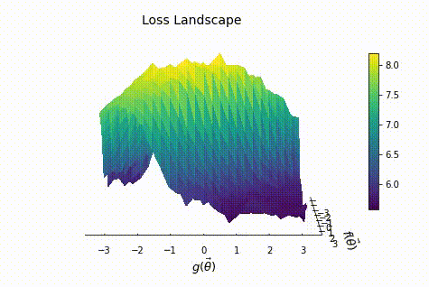
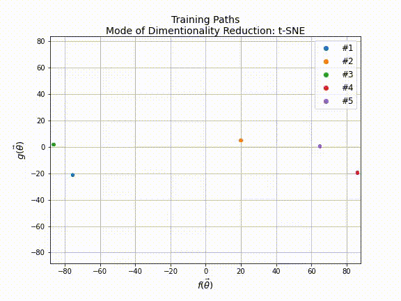

  <!-- Continious Integration -->
  
  <!-- UnitaryFund Support -->
  
  <!-- PyPI -->
  <!--    -->
  <!-- License -->
  

# qLEET

qLEET is an open-source library for exploring ***Loss landscape***, ***Expressibility***, ***Entangling capability*** and ***Training trajectories*** of noisy parameterized quantum circuits. 

This project is supported by Unitary Fund. 

## Features

1. Will support [Qiskit’s](https://qiskit.org/) and [Cirq’s](https://quantumai.google/cirq) *quantum circuits* and *noise models*.
2. Provides opportunities to improve existing algorithms like *[VQE](https://www.nature.com/articles/ncomms5213)*, *[QAOA](https://arxiv.org/abs/1411.4028)* by utilizing intuitive insights from the ansatz capability and structure of loss landscape.
3. Facilitate research in designing new hybrid quantum-classical algorithms.
   
   

## Examples

### Properties of an Ansatz

#### Ansatz

#### Expressibility

### Solving MAX-CUT using QAOA 

#### Graph

#### Loss Landscape

#### Training Path

<!--  -->

## Contributions

We love your input! We want to make contributing to this project as easy and transparent as possible, whether it's:

- Reporting a bug
- Submitting a fix
- Proposing new features

Feel free to open an issue on this repository or add a pull request to submit your contribution. Adding test cases for any contributions is a requirement for any pull request to be merged

## References

1. [Expressibility and Entangling Capability of Parameterized Quantum Circuits for Hybrid Quantum‐Classical Algorithms](https://onlinelibrary.wiley.com/doi/abs/10.1002/qute.201900070), Sim, S., Johnson, P. D., & Aspuru‐Guzik, A. Advanced Quantum Technologies, 2(12), 1900070. Wiley. (2019)
2. [Visualizing the Loss Landscape of Neural Nets](https://arxiv.org/abs/1712.09913), Hao Li, Zheng Xu, Gavin Taylor, Christoph Studer, Tom Goldstein, NIPS 2018, arXiv:1712.09913 [cs.LG] (2018)
